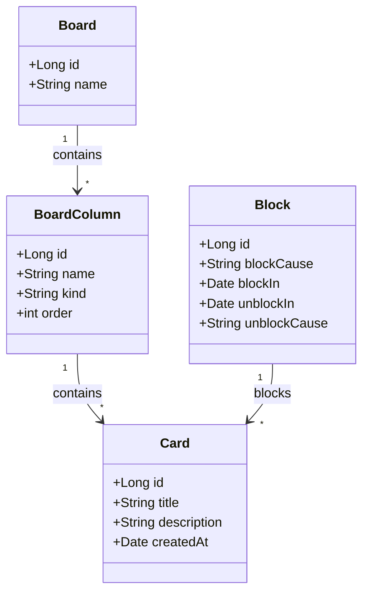

# Criando seu Board de Tarefas com Java

<h1 align="center">
    
</h1>

## Descrição do Projeto

Este projeto foi desenvolvido como parte do **programa Decola Tech** e tem como objetivo ensinar como criar um **board de tarefas** simples utilizando **Java**. O projeto passa por todas as etapas de desenvolvimento, desde o planejamento e estruturação até a implementação de funcionalidades como **gerenciamento de dados**, **integração entre camadas** e **manipulação de dados**, seguindo as melhores práticas de programação.

A aplicação permite gerenciar tarefas em diferentes estágios, como **To Do**, **In Progress** e **Done**, com uma interface para a movimentação de cards de tarefa entre esses estados.

O principal desafio foi a integração com o SQL Server, onde foram enfrentados problemas relacionados ao uso de aliases nas consultas SQL. Durante o processo de integração, surgiram dificuldades ao configurar a conexão e ao adaptar a estrutura de código para funcionar adequadamente com o banco de dados SQL Server. A solução envolveu a reconfiguração das dependências no projeto para garantir a compatibilidade com o SQL Server, incluindo a configuração do driver JDBC apropriado.

Além disso, houve a necessidade de alterações nas consultas SQL, pois o SQL Server não interpretava corretamente os aliases usados nas consultas. Essas mudanças levaram à reescrita de várias classes responsáveis por realizar inserções no banco de dados, como as classes DAO (Data Access Object), para garantir que os dados fossem inseridos corretamente nas tabelas. 

## ⛏️ Tecnologias utilizadas (Pré-requisitos):

- Java 17
- Spring Boot
- Liquibase (para controle de versão do banco de dados)
- Gradle (como ferramenta de build)
- DTO (para transferência de dados)
- SQL Server 2022 (Para armazenamento dos dados dos boards)
- DAO (Data Access Object) e Service Layer para abstração de banco de dados e lógica de negócios

## Estrutura do Projeto

O projeto é organizado em várias camadas, seguindo o modelo de arquitetura tradicional com as seguintes pastas:

- **dto**: Contém objetos de transferência de dados.
- **exception**: Contém exceções personalizadas para tratamento de erros.
- **persistence**: Camada de persistência, que inclui o acesso ao banco de dados.
- **service**: Camada de serviço com a lógica de negócios.
- **ui**: Interface de usuário, caso haja implementação de front-end ou interação com o usuário.

### Funcionalidades Implementadas:

- **Movimentação de cards**: A aplicação permite movimentar cards de tarefas entre diferentes estágios (To Do, In Progress, Done).
- **Desbloqueio de cards**: Foi implementada uma funcionalidade de desbloqueio de cards que estavam bloqueados devido a condições específicas.
- **Conclusão de tarefa**: O usuário pode marcar uma tarefa como concluída e movê-la para o estágio correspondente.

## Figma para Abstração de Domínio

O Figma foi utilizado para a abstração do domínio desta API, sendo essencial na análise e projeto da solução. A ferramenta ajudou a mapear as entidades e a estrutura de dados, garantindo uma visão clara da arquitetura e das interações entre os componentes da aplicação.

### Diagrama de Classes (Domínio da API)
A seguir, você encontrará o Diagrama de Classes, que ilustra a estrutura do domínio da API, as entidades envolvidas e os relacionamentos entre elas.



### Capturas de Tela da Execução do Projeto

Aqui estão algumas capturas de tela que ilustram o funcionamento do board de tarefas:

####  Tela 1: Cadastro de um board de tarefas  e visualização no banco de dados
<h1 align="center">
    
</h1>
<h1 align="center">
    
</h1>

####  Tela 2: Cadastro de um card e visualização no banco de dados
<h1 align="center">
    
</h1>
<h1 align="center">
    
</h1>

####  Tela 3: Alteração do status do Card e visualização no banco de dados
<h1 align="center">
    
</h1>
<h1 align="center">
    
</h1>

####  Tela 4: Exclução do Board 
<h1 align="center">
    
</h1>

<h1 align="center">
    
</h1>

---

###  Objetivos do Projeto:

- Criar um board de tarefas funcional com **movimentação de cards** entre diferentes estados.
- Implementar uma **camada de persistência** eficiente, com integração a um banco de dados.
- Aplicar boas práticas de **arquitetura de software**, como camadas bem definidas (DTO, DAO, Service).
- Utilizar o **Liquibase** para controle de versão do banco de dados e migrações.

#  ⚙️ Como Rodar o Projeto Localmente:  <a name = "tinstall"></a>
### Pré-requisitos

### Pré-requisitos

- **Java 17**
- **Gradle** 
- **Liquibase** 
- **Banco de Dados SQL Server**

### Instalação

#### 1. Clone este repositório:

```bash
git clone https://github.com/viniciosmucheirone/DIO-Board-Java.git
```
#### 2. Navegue até o diretório do projeto:
```bash
cd DIO-Board-Java
```
#### 3. Abra o projeto na sua IDE favorita (como IntelliJ IDEA ou Eclipse).

#### 4. Configure seu banco de dados (pode ser um banco de dados MySQL, PostgreSQL ou qualquer outro de sua escolha).

#### 5. Se estiver usando Liquibase para migrações, execute o comando para aplicar as migrações:
```
./gradlew update
```
#### 6. Execute o projeto com o comando:
```
./gradlew bootRun
```
Agora, sua aplicação estará rodando localmente e você pode começar a interagir com o board de tarefas.

## Conclusão
Este projeto foi uma excelente oportunidade para aplicar os conceitos aprendidos no Decola Tech. A criação de um board de tarefas em Java me permitiu praticar e melhorar minhas habilidades em desenvolvimento de software e arquitetura de sistemas. Além disso, a implementação de uma solução escalável e eficiente com boas práticas de codificação foi fundamental para o aprendizado.